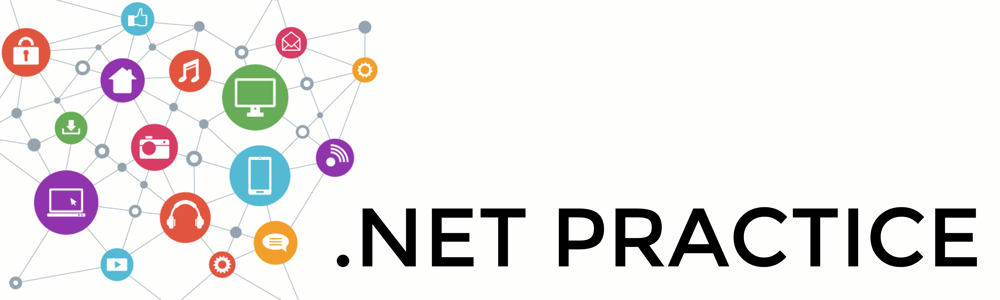
## introduction
This project aims to introduce you to the network through practical cases.
* This readme is not meant to only pass the net_practice project but rather a general guide to networking.
* For a detailed explanation of how to pass the net practice exercises, you can refer to the attached github:

  * [Guide to NetPractice](https://github.com/Laubester/NetPractice)
  * [Net_Practice](https://github.com/tblaase/Net_Practice#level-2)

## Table content

* ☞&nbsp;&nbsp; **[ General concept ](#titre1)**
  * [ What is a **network protocol**? ](#network)
  * [ What is the **OSI model**? ](#OSI)

* ☞&nbsp;&nbsp; **[ main concept ](#titre)**
  * [ What is the **IP** or Internet Protocol? ](#IP)
  * [ What is the **TCP** or Transmission Control Protocol? ](#TCP)
  * [ What is the **Subnet**? ](#Subnet)
  * [ What is the **Subnet Mask**? ](#sMask)

----

  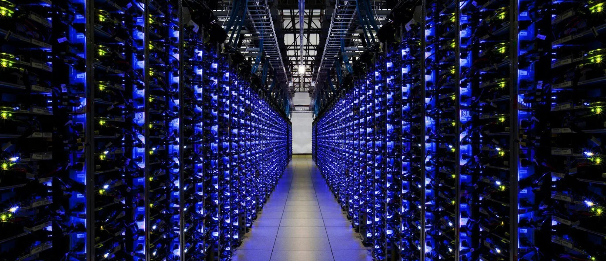

----

## General Concept

#### ℹ️ &nbsp;&nbsp;**General information on how the network as a whole works.**

 

	
  
<b> 🔽 What is a network protocol?  </b>

   

* In networking, **a `protocol` is a set of rules for formatting and processing data**. Network protocols are like a common 
language for computers. Computers on a network may use very different software and hardware, but **the use of protocols 
allows them to communicate with each other**.

> For example two people who do not speak the same language, one French and one German, would have a second language
to understand each other, English.

* **On the Internet, there are different protocols for different types of processes.** Protocols are often discussed in
  terms of the layer of the `OSI` model to which they belong.

----

	
  
<b> 🔽 What is the OSI model?  </b>

   

* The `OSI` (Open Systems Interconnection) model is an abstract representation of how the Internet works.
* It is made up of 7 layers: 

  &nbsp;&nbsp;&nbsp;&nbsp;&nbsp;&nbsp;&nbsp;&nbsp;&nbsp;
  [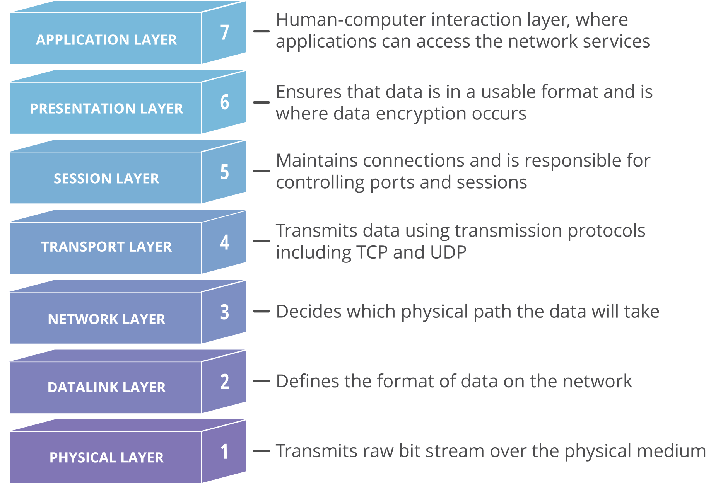](img/osi-model-7-layers.png)

* Each layer representing a different category of networking functions, **the protocols make these networking 
functions possible**.

* ☞ &nbsp;&nbsp;&nbsp;The [ **Internet Protocol** (`IP`) ](#TCP) makes network-to-network communications possible. `IP` 
is considered a **[network layer](https://www.cloudflare.com/learning/network-layer/what-is-the-network-layer/)** 
(Layer 3) protocol

* ☞ &nbsp;&nbsp;&nbsp;The [ **Transmission Control Protocol** (`TCP`) ](#TCP) ensures the smooth transport of data packets over networks. 
Therefore, TCP is considered a transport layer (Layer 4) protocol.
* ℹ️ More information about OSI [here](https://www.cloudflare.com/learning/ddos/glossary/open-systems-interconnection-model-osi/).

----

  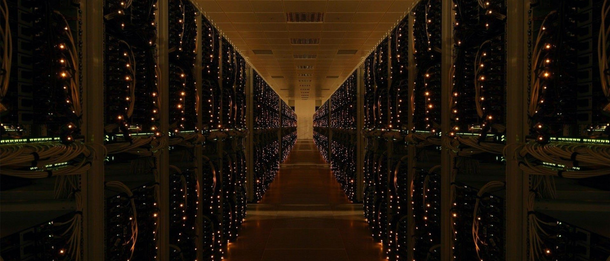

----

## main concept

#### ℹ️&nbsp;&nbsp;**The following themes are important for the net practice project.**

	
  
<b>🔽 What is the internet Protocol (IP) ?</b>

   

  &nbsp;&nbsp;&nbsp;&nbsp;&nbsp;&nbsp;&nbsp;[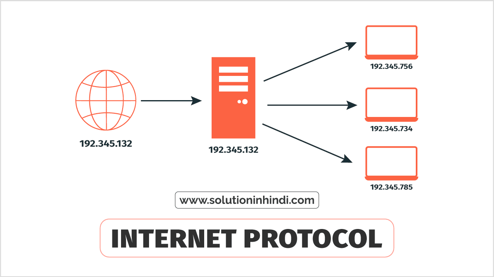](img/ip.png)
* **Internet Protocol** `(IP)` is a `protocol`, or set of rules, for **routing and addressing data packets** so that they can 
traverse networks and arrive at the correct destination.

----

	
  
<b>🔽️ What is the internet Protocol address ?</b>

   

* > the `IP` **address** is similar to the phone number assigned to your smartphone.
* An `IP` **address** is a unique number that **allows a computer to communicate in a network**. 
  * ⚠️ There **cannot** be several **computers** with the **same `IP` address** in the same network.
  * The unique **number** can be **assigned temporarily or permanently**.
* Each `IP` **address** is a series of characters, such as 192.168.1.1,
**[DNS resolvers](https://www.cloudflare.com/learning/dns/what-is-dns/)** translate human-readable domain names into IP 
addresses.

  &nbsp;&nbsp;&nbsp;&nbsp;&nbsp;&nbsp;&nbsp;
  [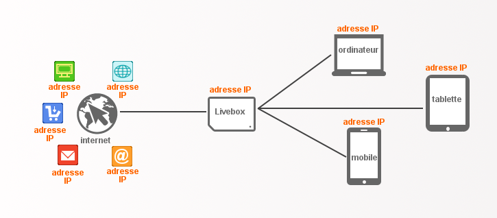](img/schema-adresse-ip.png)

* **Two types of IP addresses**: public IP addresses and local IP addresses:
  * `Local IP addresses`: these are managed at the level of your local network between the **[ADSL modem](https://fr.wikipedia.org/wiki/Modem)** 
  and **[Ethernet or Wi-Fi router](https://fr.wikipedia.org/wiki/Routeur)**, and your equipment (computers, mobiles, 
  connected objects, etc.)
  * `Public IP addresses`: these are managed globally by an organization that allocates these addresses individually to all
  equipment and services connected to the Internet (websites, video hosting sites, etc.).

  &nbsp;&nbsp;&nbsp;&nbsp;&nbsp;&nbsp;&nbsp;
  [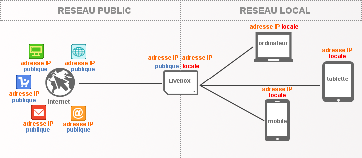](img/schema-adresse-ip-interne-externe.png)

* **IPv4 vs IPv6:**
  * `IPv4` addresses contain a sequence of **four number**, ranging from **0 (except the last) to 255**, each separated 
  from the next by a dot, for example, 5.62.42.77.
  * `IPv6` addresses consist of **8 groups of 4 hexadecimal characters**, numbered **0-9 and A-F**, and separated by a colon 
  (example: 2001:db8:17d4:e800:ee56:9889:ff50:4e9a). This is the successor to IPv4. It is being deployed gradually 
  and is only used for public IP addresses.

  &nbsp;&nbsp;&nbsp;&nbsp;&nbsp;&nbsp;&nbsp;
  [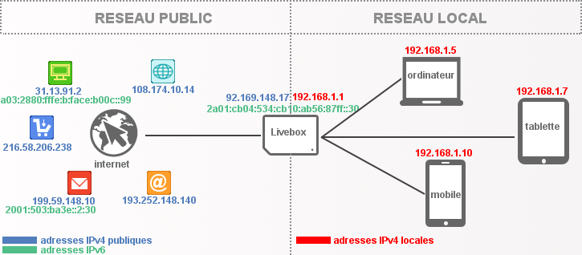](img/schema-adresse-ipv6-nommage.png)

* **IN GENERAL: An IP address consists of two parts:**
  * `The network ID`, consisting of the **first three digits** of the address.
  * `Host ID`, the **fourth digit** of the address.

  &nbsp;&nbsp;&nbsp;&nbsp;&nbsp;&nbsp;&nbsp;
  [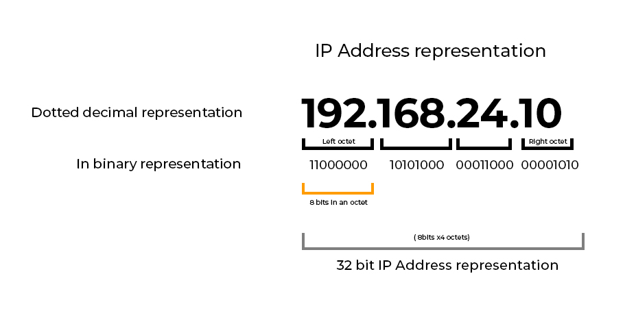](img/ip-address-representation.jpg)

* BUT...

* The Internet community has imposed an international authority: the **[IANA](http://www.iana.org/)**, 
  which grants address quotas to professionals who redistribute them.

	
  
<b>🔽️ IANA authority</b>

   

* If you want to access the network, there are two solutions:

  * You subscribe to an Internet Service Provider.
  * When you connect, he will automatically distribute one to you.
  * It is part of the set of addresses that your access provider has rented, for a fee, from IANA or a local 
  organization representing it.

  * You yourself rent a fixed IP address that will characterize your access to the network.

* **IANA** compliant addresses are **divided into classes**.
  * All addresses written in **binary that begin** on the `left` with the digit `0` are Class `A`
  * All addresses written in **binary that begin** on the `left` with the digits `10` are class `B`
  * All addresses written in **binary starting** on the `left` with the digits `110` are class `C`
  * All addresses that, written in **binary, begin** on the `left` with the digits `1110` are class `D`

&nbsp;&nbsp;&nbsp;&nbsp;&nbsp;&nbsp;&nbsp;
[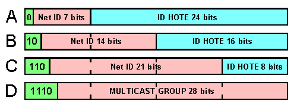](img/img/adr_ip_500.png)

* A fixed IP that will characterize your network access.

 

 
	
  
<b>Avast infographic ip address in image: English</b>

   
    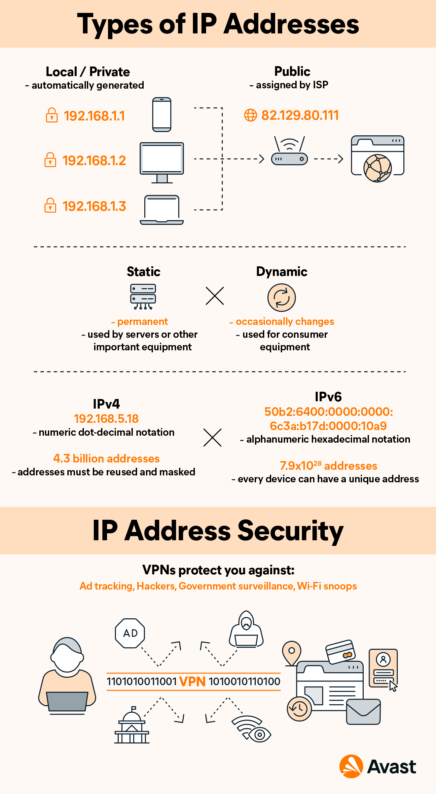

	
  
<b>Avast infographic ip address in image: Francais</b>

   
    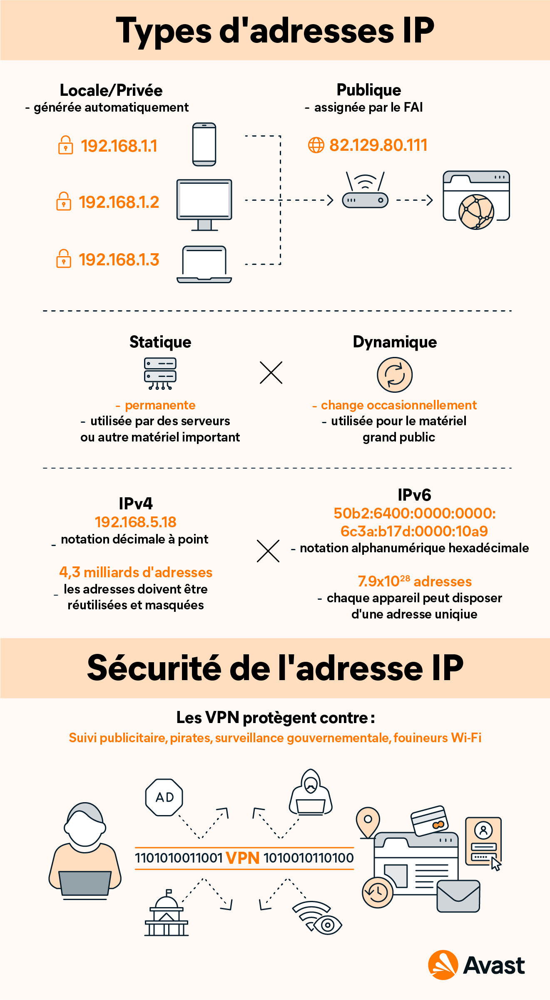

	
  
<b>Avast infographic ip address in image: Deutsch</b>

   
    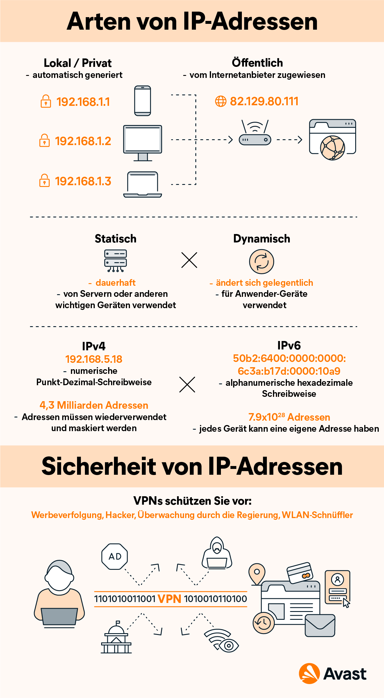

----

	
  
<b> 🔽 What is the Transmission Control Protocol (TCP) ?</b>

   

* `TCP` **is a transport layer protocol that ensures reliable delivery of data**. TCP is intended to be used with IP, and 
the two protocols are often referred to together as TCP/IP.
* > If the IP address is similar to the phone number assigned to your smartphone. 
*  > TCP is all the technology that makes 
the phone ring and allows you to talk to someone on another phone. They are different from each other, 
but they are also meaningless without each other.

	
  
<b> 🔽 So what is (TCP/IP) ?</b>

   

* The `TCP/IP` relationship is like **mailing** a message **written on a puzzle** to a recipient.
*  > The message is written on the whole puzzle and then the puzzle is broken down. Each piece can then follow a different postal route. When the puzzle pieces arrive after following their different routes, they can be in any order.
*  > The `IP` protocol ensures that the pieces arrive at their destination address.
*  > `TCP` can be seen as the assembler of the puzzle on the receiver's side, putting the pieces back in the right order, requesting that missing pieces be returned and informing the sender that the puzzle has been received.
*  > `TCP` maintains the connection with the sender from before the first piece of the puzzle was sent until after the last piece was sent.

* Difference between `TCP/IP` and other protocol **[UDP/ IP](https://www.cloudflare.com/fr-fr/learning/ddos/glossary/user-datagram-protocol-udp/)**

&nbsp;&nbsp;&nbsp;&nbsp;&nbsp;&nbsp;&nbsp;&nbsp;&nbsp;[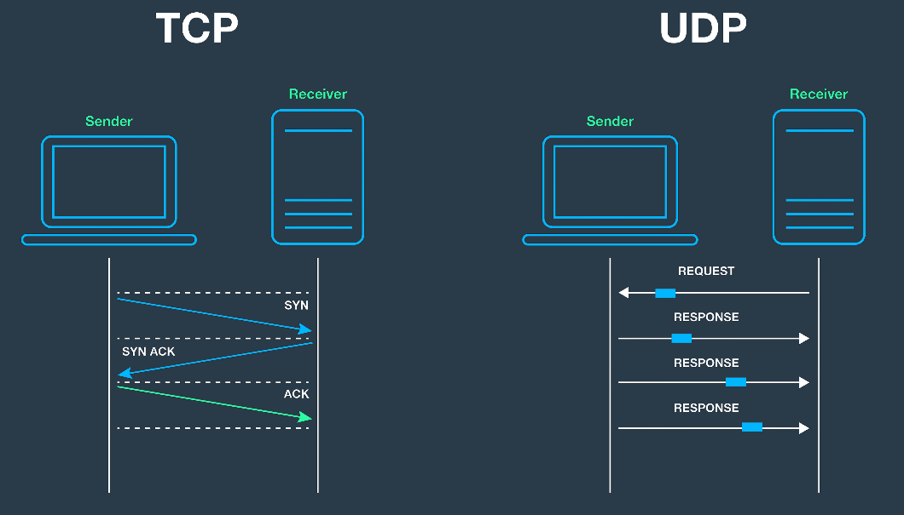](img/tcp-ip_udp-ip.png)

	
  
<b> 🔽 What is the Subnet ?</b>

 
 

&nbsp;&nbsp;&nbsp;&nbsp;&nbsp;&nbsp;&nbsp;&nbsp;
[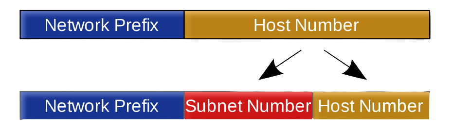](img/Subnetting_operation.png)

* A subnet is a logical subdivision of a larger network. The subnet mask distinguishes between the part of the address 
  that is common to all devices on the subnet and the part that varies from device to device. A subnet typically 
  corresponds to an underlying local network.

&nbsp;&nbsp;&nbsp;&nbsp;&nbsp;&nbsp;&nbsp;&nbsp;
[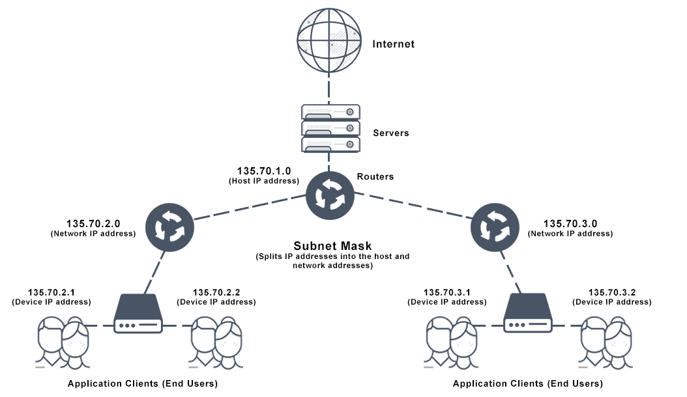](img/Subnet-mask-diagram.png)

* **An analogy to explain IP subnet, subnet address and subnet mask (made by 
[ManageEngine](https://www.manageengine.com/fr/oputils/ip-subnetting.html)):**  
  * > 0️⃣&nbsp; You organize a summer camp, you teach music, art, dance and theatre to students. 
  * > 1️⃣&nbsp; You want to **uniquely identify each student** so that a student **ID number** tells you the 
  **student's class and role number**. 
  You have rented a room for your camp, you **put up partitions to 
  separate the room into four different rooms**. 
  Because we don't want the classes to interfere with each other. 
  **it is easier to create unique identifiers 
  within one class than in all four classes together**.
  * > 2️⃣&nbsp; Each student is assigned to a class. **Allows each class to be assigned a class ID**. 
  For `art class` it is `01`, for `music` it is `02`, for `dance` `03`,
  and for `drama` it is `04`. 
  There are **20 students enrolled in each class**. So we have the 
  list numbers from `1 to 20` in each classroom. 
  In order to identify which pupil belongs to which class,
  we **give each pupil an identity card with his class ID and roll number**.  
  ▶️&nbsp; **A student with roll number `13` enrolled in a 
  `music course` has an ID card that says `0213`.**
  * > 3️⃣&nbsp; Let's say someone has found **four lost ID cards** and wants to return them to the students. 
  They can easily find out which class the student belongs to 
  by simply placing a mask over the last two numbers;  
  ▶️&nbsp; **The first two numbers will give them the class ID.**  

&nbsp;&nbsp;&nbsp;&nbsp;&nbsp;&nbsp;&nbsp;&nbsp;&nbsp;&nbsp;&nbsp;&nbsp;&nbsp;&nbsp;
[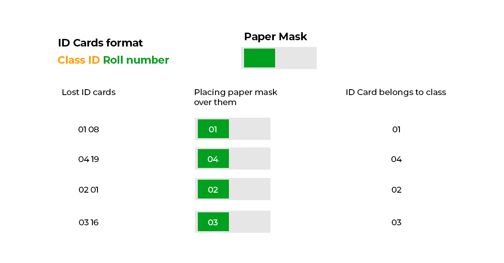](img/img-id-cards.jpg)

* **Similarly, a network can consist of several hosts.** 
  To efficiently assign addresses to these hosts, we partition the network (`hall`) into subnets (`classrooms`). 
  Within the monitored IP subnets, each has a network ID (class ID).
  The hosts in the subnet have a host ID (`roll number`). To identify which host belongs to which subnet, 
  we use the subnet mask (`paper mask`).

  
<b> 🔽 What is the Subnet Mask ?</b>

 

* [ManageEngine](https://www.manageengine.com/fr/oputils/ip-subnetting.html) definition: 
A `32-bit` representation used by a `TCP/IP` network to define the range of` IP addresses` available in a subnet.

* A `subnet mask` is a mask that distinguishes the bits **of the subnet** of an `IPv4 address` from those used to 
**identify** the host, and is obtained by applying the **binary** `AND` operator between the `IPv4` address and 
the `subnet mask`.
* The `host address` within the subnet is obtained by applying the `AND` operator between the 
`IPv4 address` and the one's complement of the mask.

* `Subnet masks` use the **same representation** as `IPv4 addresses`.
In `IPv4`, an `IP address` is **encoded in 4 bytes**, or **32 bits** (represented in dot decimal notation).
The `subnet mask` also has **4 bytes**.
In practice, made-up masks are used (in their binary form), so there are **32 possible** `network masks`.

-----

  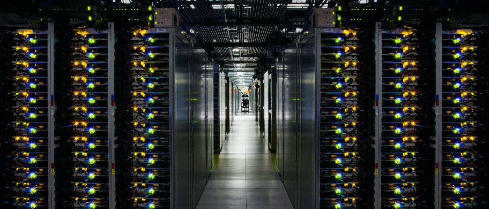

----
## Ressources

* [net practice subject](https://cdn.intra.42.fr/pdf/pdf/58600/fr.subject.pdf)

* **Network Protocol documentation**
  * [Qu'est-ce qu'un protocole? | Définition d'un protocole de réseau](https://www.cloudflare.com/fr-fr/learning/network-layer/what-is-a-protocol/)

* **IP documentation**
  * [Adresse IP - Définition et Explications](https://www.techno-science.net/glossaire-definition/Adresse-IP.html)
  * [Qu'est-ce qu'une adresse IP? ](https://www.avast.com/fr-fr/c-what-is-an-ip-address)
  * [Qu'est-ce que IP (Internet Protocol)?](https://www.cloudflare.com/fr-fr/learning/network-layer/internet-protocol/)
  * [Adresses IP : les éléments à connaître ](https://assistance.orange.fr/livebox-modem/toutes-les-livebox-et-modems/installer-et-utiliser/piloter-et-parametrer-votre-materiel/le-parametrage-avance-reseau-nat-pat-ip/gerer-votre-adresse-ip/adresses-ip-les-elements-a-connaitre-_238182-760947)
  * [4° Réseaux & sous-réseaux IP](http://arsene.perez-mas.pagesperso-orange.fr/reseaux/tcpip/reseaux_ip.htm) 

* **TCP documentation**
  * [Transmission Control Protocol wiki](https://fr.wikipedia.org/wiki/Transmission_Control_Protocol)
  * [rfc support](https://www.rfc-editor.org/rfc/rfc793)

* **Subnet**
  * [Introduction au sous-réseau IP à l'aide de CIDR et VLSM](https://www.manageengine.com/fr/oputils/ip-subnetting.html) 
  * [Sous-réseau - Définition et Explications](https://www.techno-science.net/definition/3813.html)
  * [sous-réseau - wikipedia](https://fr.wikipedia.org/wiki/Sous-r%C3%A9seau)
